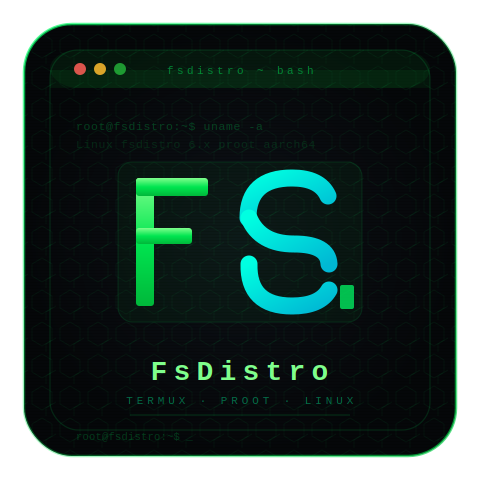

<div align="center">

<!-- Logo -->


# FsDistro

**A custom Linux distribution for Termux proot-distro**

[](LICENSE)
[](https://github.com/termux/proot-distro)
[]()
[]()

*A lightweight, customized Linux environment running inside Termux via proot — no root required.*

</div>

---

## 📖 About

**FsDistro** is a custom Linux distribution built to run inside [Termux](https://termux.dev) using [proot-distro](https://github.com/termux/proot-distro). It provides a full Linux userland environment on Android without requiring root access, giving you a familiar shell environment optimized for mobile hacking, development, and daily use on-the-go.

- 🚫 **No root required** — runs entirely in userspace via proot
- 📱 **Android-native** — designed for aarch64 and x86_64 Android devices
- 🐚 **Shell-first** — built around a clean, productive terminal experience
- 🪶 **Lightweight** — minimal base with only what you need

---

## ✨ Features

- Full Bash shell environment with custom configs
- Pre-configured package manager (apt/pacman)
- Custom `.bashrc` / `.profile` with useful aliases and prompt
- Optimized for use inside Termux proot
- Works on Android 7.0+ (API 24+)

---

## 📋 Requirements

| Requirement | Details |
|---|---|
| **App** | [Termux](https://f-droid.org/en/packages/com.termux/) (F-Droid version recommended) |
| **Package** | `proot-distro` |
| **Android** | 7.0+ (API 24+) |
| **Architecture** | aarch64, x86_64 |
| **Storage** | ~200 MB free space |

---

## ⚡ Installation

### 1. Install Termux

Download Termux from [F-Droid](https://f-droid.org/en/packages/com.termux/) (the Google Play version is outdated and not recommended).

### 2. Install proot-distro

```bash
pkg update && pkg upgrade -y
pkg install proot-distro -y
```

### 3. Install FsDistro

```bash
# Install git if you don't have it
pkg install git -y

# Clone the repo
git clone https://github.com/yourusername/fsdistro.git
cd fsdistro

# Run the installer
bash install.sh
```

> ⚠️ FsDistro can only be installed via GitHub. There is no curl/pip/pkg method.

### 4. Login

```bash
proot-distro login fsdistro
```

You're in! 🎉

---

## 🖥️ Usage

### Login to FsDistro

```bash
proot-distro login fsdistro
```

### Login as root

```bash
proot-distro login fsdistro --user root
```

### Run a single command

```bash
proot-distro login fsdistro -- uname -a
```

### Remove FsDistro

```bash
proot-distro remove fsdistro
```

---

## 📁 Project Structure

```
fsdistro/
├── install.sh          # Main installer script
├── fsdistro.sh         # proot-distro plugin definition
├── rootfs/             # Rootfs overlay files
│   ├── etc/
│   │   ├── bashrc      # Custom bash config
│   │   └── profile     # Shell profile
│   └── usr/
│       └── local/
│           └── bin/    # Extra scripts/tools
├── README.md
└── LICENSE
```

---

## ⚙️ Configuration

After logging in, you can customize your environment:

```bash
# Edit bash config
nano ~/.bashrc

# Edit shell profile
nano /etc/profile

# Install packages (Debian-based)
apt update && apt install <package>
```

---

## 🔧 Troubleshooting

**`proot-distro` not found**
```bash
pkg install proot-distro
```

**Permission denied on install.sh**
```bash
chmod +x install.sh && bash install.sh
```

**Network not working inside distro**
```bash
# Run this inside FsDistro
echo "nameserver 8.8.8.8" > /etc/resolv.conf
```

**Display issues / terminal garbled**
```bash
export TERM=xterm-256color
```

---

## 🤝 Contributing

Contributions, issues, and feature requests are welcome!

1. Fork the repository
2. Create your feature branch: `git checkout -b feature/my-feature`
3. Commit your changes: `git commit -m 'Add my feature'`
4. Push to the branch: `git push origin feature/my-feature`
5. Open a Pull Request

---

## 📄 License

This project is licensed under the [MIT License](LICENSE).

---

## 🙏 Acknowledgements

- [Termux](https://termux.dev) — the Android terminal that makes this possible
- [proot-distro](https://github.com/termux/proot-distro) — the distro management layer
- [proot](https://proot-me.github.io/) — userspace chroot implementation

---

<div align="center">

Made with 🖤 for the terminal

</div>
